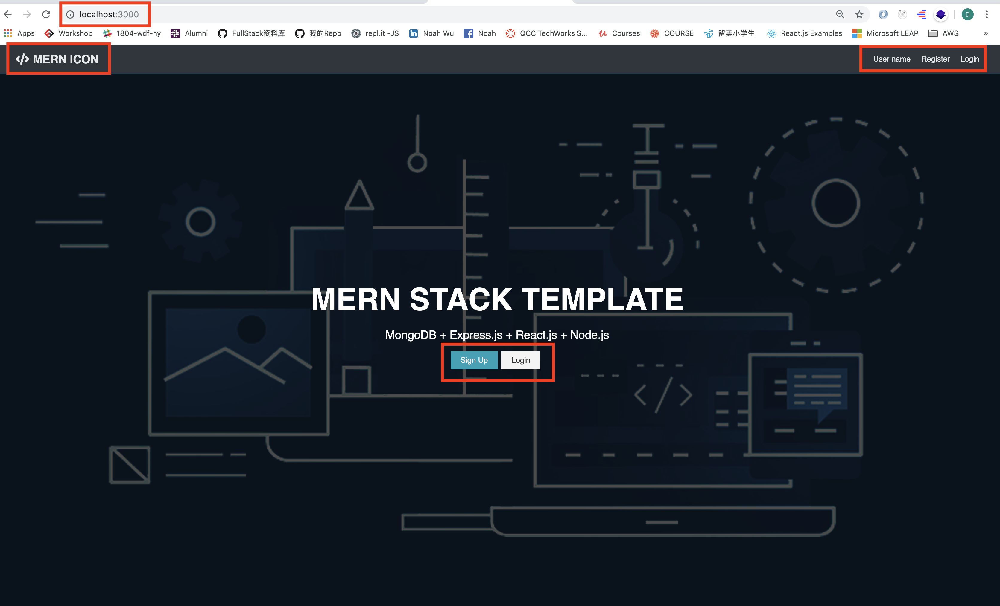
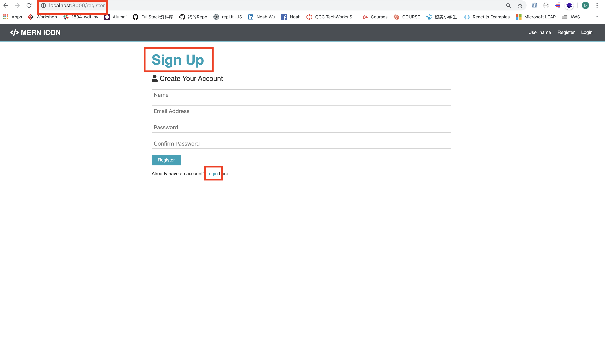
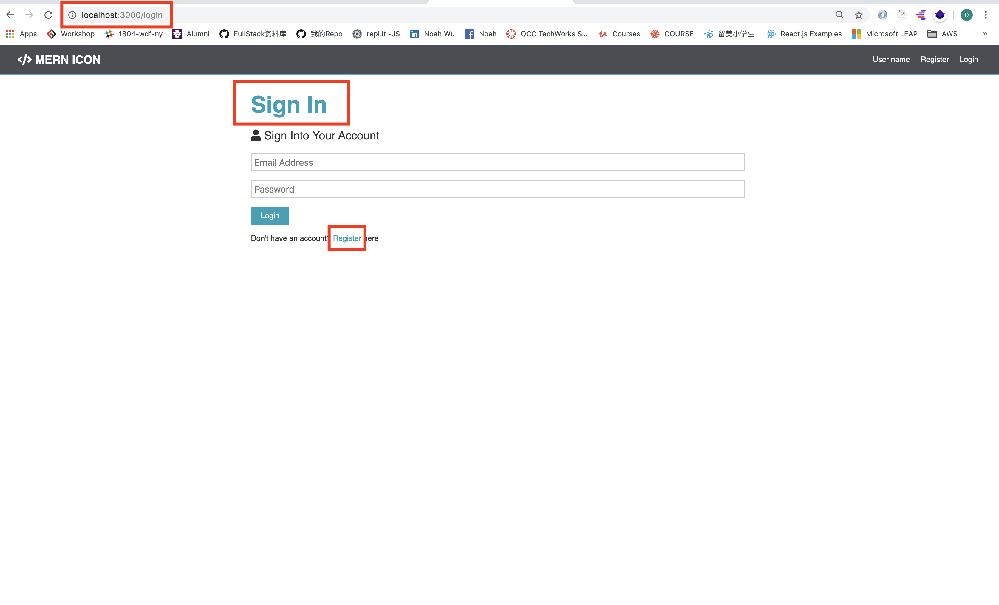

# MERN-Template(part 7)
## `Section: Frontend`(Setup React-Router & Form)

### `Summary`: In this documentation, we setup react-router and Form for the front end.

### `References(相关基础知识)：`
- [Basic React-Router](https://github.com/DonghaoWu/React-Level7-React-Router-Basic)
- [Basic React-Form](https://github.com/DonghaoWu/React-Level4-React-Form-Basic)

### `Check Dependencies:`

- concurrently (back-end)
- react
- axios
- react-router-dom
- redux
- react-redux
- redux-thunk
- redux-devtools-extension
- moment
- react-moment
- uuid

### `Brief Contents & code position`
- *7.1 Wrap the code with React Router. `./client/src/App.js`
- *7.2 Create a new file, 'Register.js' `./client/src/components/auth/Register.js`
- *7.3 Create a new file, 'Login.js' `./client/src/components/auth/Login.js`
- *7.4 Add Link tag to 'Navbar.js', `./client/src/components/layout/Navbar.js`
- *7.5 Add Link tag to 'Landing.js', `./client/src/components/layout/Landing.js`

### `Step1: setup react-router:`

#### `(*7.1)Location: ./client/src/App.js`

```js
import React, { Fragment } from 'react';
import { BrowserRouter as Router, Route, Switch } from 'react-router-dom'
import Landing from './components/layout/Landing';
import Navbar from './components/layout/Navbar';
import Login from './components/auth/Login';
import Register from './components/auth/Register';
import './App.css';

const App = () => (
  <Router>
    <Fragment>
      <Navbar />
      <Route exact path='/' component={Landing} />
      <section className='container'>
        <Switch>
          <Route exact path='/register' component={Register} />
          <Route exact path='/login' component={Login} />
        </Switch>
      </section>
    </Fragment>
  </Router>
)

export default App;
```

#### `Comments:`
- 使用React-Router第一步是引用基本三大件：BrowserRouter, Route, Switch, 并用Router包住整个视图；
- 在这里主要一个疑问是，为什么不把第一个Route放进Switch中，答案是第一个Route是要作为默认Route（Landing）即是第一个需要出现的页面，所以不用放进Switch中。

### `Step2: Create 'Register.js'.`

#### `(*7.2)Location: ./client/src/components/auth/Register.js`

```js
import React, { Fragment, useState } from 'react';
import { Link } from 'react-router-dom';

const Register = props => {
    const [formData, setFormData] = useState({
        name: '',
        email: '',
        password: '',
        password2: '',
    });

    const { name, email, password, password2 } = formData;
    const handleChange = (e) => {
        setFormData({
            ...formData, [e.target.name]: e.target.value
        })
    }

    const handleSubmit = async (e) => {
        e.preventDefault();
    }

    return (
        <Fragment>
            <h1 className="large text-primary">Sign Up</h1>
            <p className="lead"><i className="fas fa-user"></i> Create Your Account</p>
            <form className="form" action="create-profile.html" onSubmit={e => handleSubmit(e)}>
                <div className="form-group">
                    <input
                        type="text"
                        placeholder="Name"
                        name="name"
                        value={name}
                        onChange={e => handleChange(e)}
                        required
                    />
                </div>
                <div className="form-group">
                    <input
                        type="email"
                        placeholder="Email Address"
                        name="email"
                        value={email}
                        onChange={e => handleChange(e)}
                        required
                    />
                </div>
                <div className="form-group">
                    <input
                        type="password"
                        placeholder="Password"
                        name="password"
                        value={password}
                        onChange={e => handleChange(e)}
                        minLength="6"
                        required
                    />
                </div>
                <div className="form-group">
                    <input
                        type="password"
                        placeholder="Confirm Password"
                        name="password2"
                        value={password2}
                        onChange={e => handleChange(e)}
                        minLength="6"
                        required
                    />
                </div>
                <input type="submit" className="btn btn-primary" value="Register" />
            </form>
            <p className="my-1">
                Already have an account? <Link to="/login">Login </Link>here
            </p>
        </Fragment>
    )
}

export default Register;
```

#### `Comments:`
- 使用React-Form，主要关注几点，2个函数的定义onChange和onSubmit，然后使input区域的三个properties，（name， value，onChange）；
- 在这里引用新state用法hook，有3个新变量，useState--原始state，formData--当前state，setFormData--改变state的method，用法如下。

```js
    const [formData, setFormData] = useState({
        name: '',
        email: '',
        password: '',
        password2: '',
    });

    const { name, email, password, password2 } = formData;

    setFormData({
        ...formData, [e.target.name]: e.target.value
    })
```

### `Step3: Create 'Login.js'.`

#### `(*7.3)Location: ./client/src/components/auth/Login.js`

```js
import React, { Fragment, useState } from 'react';
import { Link } from 'react-router-dom';

const Login = () => {
    const [formData, setFormData] = useState({
        email: '',
        password: '',
    });

    const { email, password } = formData;
    const handleChange = (e) => {
        setFormData({
            ...formData, [e.target.name]: e.target.value
        })
    }

    const handleSubmit = async (e) => {
        e.preventDefault();
    }

    return (
        <Fragment>
            <h1 className="large text-primary">Sign In</h1>
            <p className="lead"><i className="fas fa-user"></i> Sign Into Your Account</p>
            <form className="form" action="create-profile.html" onSubmit={e => handleSubmit(e)}>
                <div className="form-group">
                    <input
                        type="email"
                        placeholder="Email Address"
                        name="email"
                        value={email}
                        onChange={e => handleChange(e)}
                        required />
                </div>
                <div className="form-group">
                    <input
                        type="password"
                        placeholder="Password"
                        minLength="6"
                        name="password"
                        value={password}
                        onChange={e => handleChange(e)}
                        required
                    />
                </div>
                <input type="submit" className="btn btn-primary" value="Login" />
            </form>
            <p className="my-1">
                Don't have an account? <Link to="/register">Register </Link>here
                </p>
        </Fragment>
    )
}

export default Login;
```

### `Step4: Add Link tag to 'Navbar.js'.`

#### `(*7.4)Location: ./client/src/components/layout/Navbar.js`

```js
import React from 'react';
import { Link } from 'react-router-dom';

const Navbar = props => {
    return (
        <nav className="navbar bg-dark">
            <h1>
                <Link to="/"><i className="fas fa-code"></i> MERN ICON</Link>
            </h1>
            <ul>
                <li><Link to="/">User name</Link></li>
                <li><Link to="/register">Register</Link></li>
                <li><Link to="/login">Login</Link></li>
            </ul>
        </nav>
    )
}

export default Navbar
```

### `Step5: Add Link tag to 'Landing.js'.`

#### `(*7.5)Location: ./client/src/components/layout/Landing.js`

```js
import React from 'react';
import { Link } from 'react-router-dom';

const Landing = props => {
    return (
        <section className="landing">
            <div className="dark-overlay">
                <div className="landing-inner">
                    <h1 className="x-large">MERN STACK TEMPLATE</h1>
                    <p className="lead">MongoDB + Express.js + React.js + Node.js</p>
                    <div className="buttons">
                        <Link to="/register" className="btn btn-primary">Sign Up</Link>
                        <Link to="/login" className="btn btn-light">Login</Link>
                    </div>
                </div>
            </div>
        </section>
    )
}

export default Landing
```

### `Step6: Test it.`

- Make sure the button is working and direct to the right page

<p align="center">

</p>

<p align="center">

</p>

<p align="center">

</p>