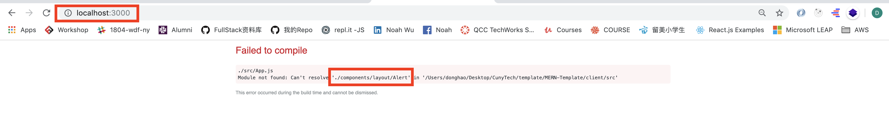

# MERN-Template(part 8)
## `Section: Frontend`(Setup Redux)

### `Summary`: In this documentation, we setup Redux stores, reducers, actions, types.

### `Important`: Figuring out how `dispatch` works is the key to understand Redux.（重点在于代码8.5和8.6），dispatch中的打包object就是reducer中的action，这个object包含type和payload两个key，reducer按照type来决定动作，暗战payload决定相关动作内容。
- 另外，一个函数里面可以使用多个dispatch，可以是多个dispatch原型，也可以是dispatch已打包好的dispatch函数。
- dispatch也可以使用在error handling中。

### `Check Dependencies:`

- concurrently (back-end)
- react
- axios
- react-router-dom
- redux
- react-redux
- redux-thunk
- redux-devtools-extension
- moment
- react-moment
- uuid

### `Brief Contents & code position`
- *8.1 Create a 'store.js' file `./client/src/store.js`
- *8.2 Add store to App.js.`./client/src/App.js`
- *8.3 Create a new folder and a new file 'index.js' `./client/src/reducers/index.js`
- *8.4 Create a new folder and a new file 'types.js' 
`./client/src/actions/types.js`
- *8.5 Create a 'alert.js' file.（for state). `./client/src/reducers/alert.js`
- *8.6 Create a 'alert.js' file. (for method).`./client/src/actions/alert.js`

### `Step1: Create a 'store.js' file:`

#### `(*8.1)Location: ./client/src/store.js`

```js
import { applyMiddleware, createStore } from 'redux';
import { composeWithDevTools } from 'redux-devtools-extension';
import thunk from 'redux-thunk';
import rootReducer from './reducers';

const initialState = {};

const middleware = [thunk];

const store = createStore(
    rootReducer, 
    initialState, 
    composeWithDevTools(applyMiddleware(...middleware))
);

export default store;
```

#### `Comments:`
- 这是一个固定模版，暂时不需要研究里面的运作，主要功能是设定一些store的参数；
- 这个文件中有一个参数需要注意，就是rootReducer的路径，后面第3步会生成一个新文件夹，名字叫‘reducer’，里面有一个index.js的文件。

### `Step2: Add store to App.js.`

#### `(*8.2)Location: ./client/src/App.js`

```js
import React, { Fragment } from 'react';
import { BrowserRouter as Router, Route, Switch } from 'react-router-dom'
//components
import Navbar from './components/layout/Navbar';
import Landing from './components/layout/Landing';
import Login from './components/auth/Login';
import Register from './components/auth/Register';
import Alert from './components/layout/Alert';
//Redux & files
import { Provider } from 'react-redux';
import store from './store';
//css
import './App.css';

const App = () => (
  <Provider store={store}>
    <Router>
      <Fragment>
        <Navbar />
          <Route exact path='/' component={Landing} />
        <section className='container'>
          <Alert />
          <Switch>
            <Route exact path='/login' component={Login} />
            <Route exact path='/register' component={Register} />
          </Switch>
        </section>
      </Fragment>
    </Router>
  </Provider>
)

export default App;
```

#### `Comments:`

`在这个文件中，主要改变有：`

```diff
+ 加入了Provider，store，并包住App的所有内容，这保证全部内容都可以分享redux store；
+ 加入了一个新的组件，Alert，在part-9添加；
```

### `Step3: Create a new folder and a new file 'index.js'.`

#### `(*8.3)Location: ./client/src/reducers/index.js`

```js
import { combineReducers } from 'redux';
import alert from './alert';

//components can access state from here.
export default combineReducers({
    alert: alert,
});
```

#### `Comments:`

- 回应第1步的comment，`import rootReducer from './reducers'`就是指这个文件；
- 这个文件比较重要，因为它的名字是index.js，所以有集中窗口的功能，这里主要是`把所有的state汇总在一起供外部使用`；
- 比如这里面的引进来的alert，就是一个state，它在这里进行汇总，外界要使用的时候格式是这样(以下是Alert组件的部分代码，Alert组件需要这个state来判断状态)：

```js
const mapStateToProps = state => ({
    alerts: state.alert
})

export default connect(mapStateToProps)(Alert);
```

### `Step4: Create a new folder and a new file 'types.js'.`

#### `(*8.4)Location: ./client/src/actions/types.js`

```js
//for alert reducer
export const SET_ALERT = 'SET_ALERT';
export const REMOVE_ALERT = 'REMOVE_ALERT';
```
#### `Comments:`

- 这种做法用变量名代替字符串，是因为在reducer中写错变量名会报错，但是写错字符串不会报错。

### `Step5: Create a 'alert.js' file(for state).`

#### `(*8.5)Location: ./client/src/reducers/alert.js`

```js
import { SET_ALERT, REMOVE_ALERT } from '../actions/types';
const initialState = [];

export default function (state = initialState, action) {
    const { type, payload } = action;
    switch (type) {
        case SET_ALERT:
            return [...state, payload];
        case REMOVE_ALERT:
            return state.filter(alert => alert.id !== payload);
        default:
            return state;
    }
}
```

#### `Comments:`

- 回应第3步code，`import alert from './alert'`就是指这个文件，也就是引进这里面的state；
- 这个文件讲述如何设定原始state，state又是如何根据对应的动作（action）中的类型（type）和内容（payload）改变state的；
- 后面第5步还会加入文件夹action和其他文件。
### `这里是redux的第一个难点，它是怎么做到相应的函数执行时，这个reducer会捕捉到对应的type，然后改变state的？答案是dispatch函数，后面详解。`

### `Step6: Create a 'alert.js' file(for method).`

#### `(*8.6)Location: ./client/src/actions/alert.js`

```js
import { SET_ALERT, REMOVE_ALERT } from './types';
import uuid from 'uuid';

export const setAlert = (msg, alertType) => dispatch => {
    const id = uuid.v4();
    dispatch({
        type: SET_ALERT,
        payload: {
            msg: msg,
            alertType: alertType,
            id: id
        }
    });

    setTimeout(() => dispatch({
        type: REMOVE_ALERT,
        payload: id,
    }), 3000);
}
```
#### `Comments:`

- uuid用来产生随机不重复id；
- msg和alertType都是要进入payload的参数；
- dispatch函数有1个参数，是一个object，里面有连个key，一个是type，另外一个是payload。

#### `这里回应第5步的疑问，dispatch是怎样操作的，在这里，dispatch把两参数打包成一个object，然后把它发出去，对应的reducer（在这里是‘./actions/alert.js’）自动检测到object里面的type是自己拥有的之后，就会把object收回并按照object的内容进行处理对应的state（另外要加一句是，dispatch中的打包object就是reducer中的action）`

#### 运行顺序应该是：function在component 中执行，带入参数（或没有）=》dispatch启动 =》对应reducer按照dispatch中参数的type值捕捉动作 =》改变对应state =》将state返回需要的component =》 对应component 进行re-render。

#### 由上可总结出对应的`设计思路`:

- 在`./client/src/reducers/index.js`增加新state变量名称
- 在`./client/src/reducers`增加新reducer文件
- 在`./client/src/actions/types.js`增加新type变量
- 在`./client/src/actions`增加新method文件

### `Step7: Test it.`

- If you follow the steps, you should get this so far, Which is fine cause we didn't add  'Alert'  component.

<p align="center">

</p>