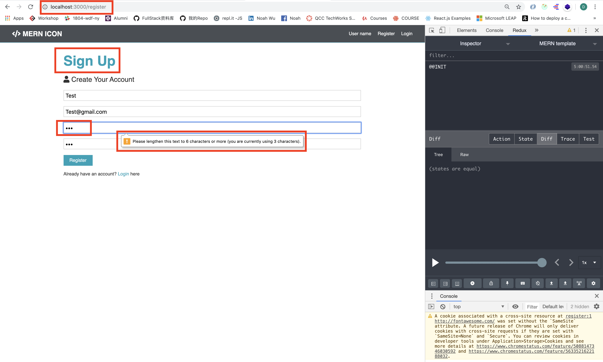
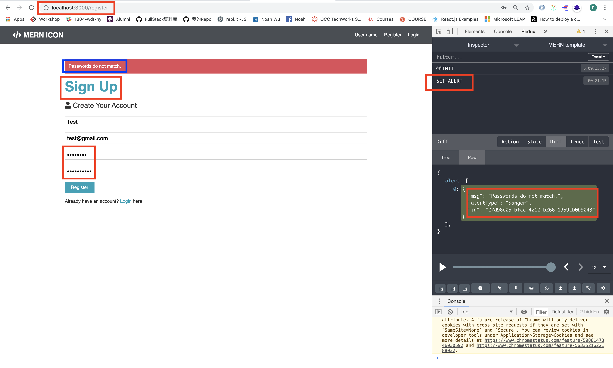

# MERN-Template(part 9)
## `Section: Frontend`(Connect Redux)

### `Summary`: In this documentation, we connect components with state and function.

### `重点`: 把method传到组件和把state传到组件的步骤需要熟练掌握（5步）。

### `Check Dependencies:`

- concurrently (back-end)
- react
- axios
- react-router-dom
- redux
- react-redux
- redux-thunk
- redux-devtools-extension
- moment
- react-moment
- uuid

### `Brief Contents & code position`
- *9.1 Connect method to 'Register'.`./client/src/components/auth/Register.js`
- *9.2 Create Alert component and connect state to it.`./client/src/components/layout/Alert.js`
- *9.3 Put Alert component to App.js'. `./client/src/App.js`

### `Step1: Connect method to 'Register to Redux:`

#### `(*9.1)Location: ./client/src/components/auth/Register.js`

```js
import React, { Fragment, useState } from 'react';
import { Link } from 'react-router-dom';
import { connect } from 'react-redux';
import { setAlert } from '../../actions/alert';
import PropTypes from 'prop-types';

const Register = props => {
    const [formData, setFormData] = useState({
        name: '',
        email: '',
        password: '',
        password2: '',
    });

    const { name, email, password, password2 } = formData;
    const handleChange = (e) => {
        setFormData({
            ...formData, [e.target.name]: e.target.value
        })
    }

    const handleSubmit = async (e) => {
        e.preventDefault();
        if (password !== password2) {
            props.setAlert('Passwords do not match.', 'danger');
        }
        else {
            console.log('SUCCESS!')
        }
    }

    return (
        <Fragment>
            <h1 className="large text-primary">Sign Up</h1>
            <p className="lead"><i className="fas fa-user"></i> Create Your Account</p>
            <form className="form" action="create-profile.html" onSubmit={e => handleSubmit(e)}>
                <div className="form-group">
                    <input
                        type="text"
                        placeholder="Name"
                        name="name"
                        value={name}
                        onChange={e => handleChange(e)}
                        required
                    />
                </div>
                <div className="form-group">
                    <input
                        type="email"
                        placeholder="Email Address"
                        value={email}
                        name="email"
                        onChange={e => handleChange(e)}
                        required
                    />
                </div>
                <div className="form-group">
                    <input
                        type="password"
                        placeholder="Password"
                        name="password"
                        minLength="6"
                        value={password}
                        onChange={e => handleChange(e)}
                        required
                    />
                </div>
                <div className="form-group">
                    <input
                        type="password"
                        placeholder="Confirm Password"
                        name="password2"
                        minLength="6"
                        value={password2}
                        onChange={e => handleChange(e)}
                        required
                    />
                </div>
                <input type="submit" className="btn btn-primary" value="Register" />
            </form>
            <p className="my-1">
                Already have an account? <Link to="/login">Login </Link>here
            </p>
        </Fragment>
    )
}

Register.propTypes = {
    setAlert: PropTypes.func.isRequired,
}

export default connect(null, { setAlert })(Register);
```

#### `Comments:`
#### `Five steps:`

```diff
+ connect -> method -> connect component -> PropTypes -> set PropTypes
```

```bash
1. import { connect } from 'react-redux';
2. import { setAlert } from '../../actions/alert';
3. export default connect(null, { setAlert })(Register);
4. import PropTypes from 'prop-types';
5. Register.propTypes = {
        setAlert: PropTypes.func.isRequired,
   }
```
#### 在这些步骤之后，可以在component中使用method:`props.setAlert(msg, alertType)`

### `Step2: Create Alert component and connect state to it.`

#### `(*9.2)Location: ./client/src/components/layout/Alert.js`

```js
import React from 'react'
import PropTypes from 'prop-types';
import { connect } from 'react-redux';


const Alert = (props) => props.alerts !== null && props.alerts.length > 0 && props.alerts.map(alert => (
    <div key={alert.id} className={`alert alert-${alert.alertType}`}>
        {alert.msg}
    </div>
))

Alert.propTypes = {
    alerts: PropTypes.array.isRequired,
}

const mapStateToProps = state => ({
    alerts: state.alert
})

export default connect(mapStateToProps)(Alert);
```

#### `Comments:`
#### `Five steps:`

```diff
+ connect -> mapStateToProps -> connect component -> PropTypes -> set PropTypes
```

```bash
1. import { connect } from 'react-redux';
2. const mapStateToProps = state => ({
        alerts: state.alert
   })
3. export default connect(mapStateToProps)(Alert);
4. import PropTypes from 'prop-types';
5. Alert.propTypes = {
        alerts: PropTypes.array.isRequired,
   }
```
#### 在这些步骤之后，可以在component中使用state:`props.alerts` <-- 一个ARRAY

### `Step3: Put Alert component to App.js.`

#### `(*9.3)Location: ./client/src/App.js`

```js
//same as *8.2
```

#### `Comments:`

- 值得注意的是Alert在App.js中放置的位置，它是在Switch之外，这样可以保证它可以出现在很多地方。

### `Step4: Test it.`

- Now you have client-side validation(input field & password matching in Register page).

<p align="center">

</p>

<p align="center">

</p>