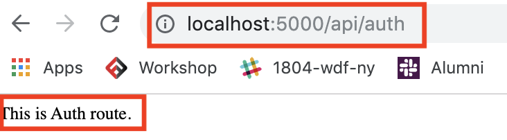

# MERN-Template(part 2)

## `Section: Backend`(Organized back end route)

### `Summary`: In this documentation, we set up api route tree.

### `Check Dependencies`

- express
- nodemon
- mongoose
- config

### `Brief Contents & codes position`
- *2.1 set up main route in server.js
- *2.2 Create ./api/index.js
- *2.3 Test http://localhost:5000/api/auth

### `Notice:`
- `Originally we can add our routes to server.js, but we can organize things a lot better by separating them.`

- (Chinese) 正如前端使用 react-router-dom 去组织前端路径树一样，express 也有相似功能让你更好地组织后端路径树,这是提升文档组织性的方法，像工程师一样思考。

### `Set up Route trees`
#### `A. Add a center route in .server.js, we can call it 'api'`

`Location: server.js`
```js
app.use("/api", require("./api"));
```

- `(*2.1)./server.js`looks like this:
```js
//package
const express = require('express');
const connectDB = require('./config/db');
//apply
const app = express();
//middleware
app.use(express.json({ extended: false }));
//port
const PORT = process.env.PORT || 5000;

/*
DB here!
*/
connectDB();

/*
Routes here!
*/
app.use("/api", require("./api"));

app.listen(PORT, () => console.log(`server is listening on port ${PORT} ===>`));
```

#### `B. Create a api folder, create a index.js file inside of it`

`(*2.2)Location: new api folder, ./api/index.js`

- This index.js file is a central clearing house for our api routes, so we can access all api routes by going through "/api" first.

```js
const router = require("express").Router();

router.use("/users", require("./users"));
router.use("/auth", require("./auth"));
router.use("/profiles", require("./profiles"));

module.exports = router;
```

#### `C. Test.`

`set simple contents and test it.`

`(*2.3)Location: ./api/auth.js`
```js
const router = require("express").Router();

router.get(`/`, (req, res) =>{
  res.send(`This is Auth route.`)
})

module.exports = router;
```
`You can get this in browser which mean this route works.`
<p align="center">

</p>

`Note:`
- You can test other routes in this way.