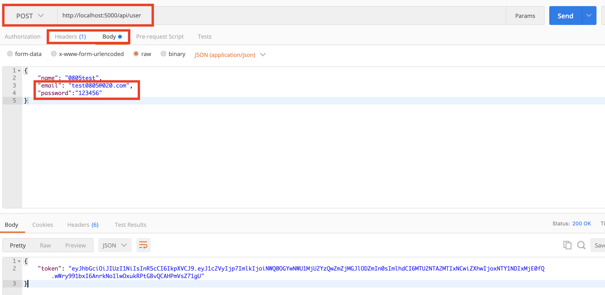
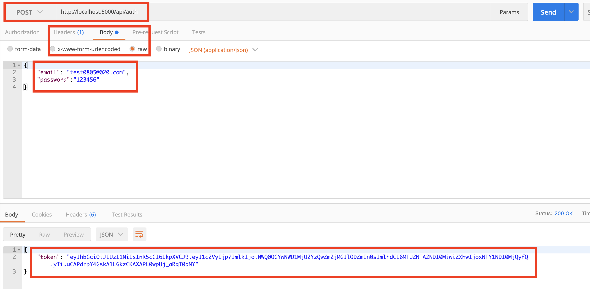

# MERN-Template(part 5)

## `Section: Backend`(Return user token after a user login)

### `Summary`: In this documentation, we set up User login route(post), when a user login, the back end can validate the info, search the database by email, then decoded the password and validate it, if everything is good, at the end of the route the app sends back a token with a user id info inside.

- 这里有一处代码错误，jwt.sign函数处，在part-12中已经修正。

### `Check Dependencies`

- express
- morgan
- nodemon
- mongoose
- express-validator (new)
- gravatar (new)
- bcryptjs (new)
- jsonwebtoken (new)

### `Brief Contents & codes position`
- *5.1 Create a login routh. `./api/auth.js`

### `Step1: Import dependencies`
`Location:./api/auth.js`
```js
const bcrypt = require('bcryptjs');//解码对比用
const {check, validationResult} = require(`express-validator`);//验证格式用
const jwt = require('jsonwebtoken');//生成token用
```

### `Step2: Create a Post auth route.`
`(*5.1)Location:./api/auth.js`

```js
const router = require('express').Router();
const auth = require('../middleware/auth');
const bcrypt = require('bcryptjs')
const jwt = require('jsonwebtoken');
const { check, validationResult } = require('express-validator');

const { User } = require('../models');

//@route   Get api/auth
//@desc    Get token and return user
//@access  Public

router.get(`/`, auth, async (req, res) => {
  try {
    const user = await User.findById(req.user.id).select('-password');
    res.json(user);
  } catch (err) {
    console.error(err.message);
    res.status(500).send('Server Error.');
  }
});

//@route   Post api/auth
//@desc    Login a user & get token
//@access  Public

router.post(
  '/',
  [
    check('email', 'Please include a valid email').isEmail(),
    check('password', 'Password is required').exists(),
  ],
  async (req, res) => {
    const errors = validationResult(req);
    if (!errors.isEmpty()) {
      return res.status(400).json({ errors: errors.array() });
    }

    const { email, password } = req.body;
    try {
      let user = await User.findOne({ email: email });

      if (!user) {
        return res
          .status(400)
          .json({ errors: [{ msg: 'Invalid Credentials' }] });
      }

      const isMatch = await bcrypt.compare(password, user.password);

      if (!isMatch) {
        return res.status(400).json({ errors: [{ msg: 'Invalid Credentials' }] });
      }

      const payload = {
        user: {
          id: user.id
        }
      };

      //之前的编码
      // const payload = {
      //   newUser: {
      //     id: newUser.id
      //   }
      // };

      //payload的命名规则。中间件的定义与使用都有规则。

      jwt.sign(
        payload,
        'mySecretToken',//wrong code
        {
          expiresIn: 360000
        },
        (err, token) => {
          if (err) throw err;
          res.json({ token: token });
        }
      );
    } catch (err) {
      console.error(err.message);
      res.status(500).send('Server error');
    }
  }
);

module.exports = router;
```

`Side-Note:`
- 本段的逻辑是实现输入电子邮箱和密码，得到验证后返回一个包含user.id的token。
- 输入两个值在request中， 一个是email， 一个是password，通过依赖中间件的过滤，如果符合格式就继续。
- 按照email去在Database中查找相关用户，如果没有就返回错误。
- 如果有该email用户，则用`await bcrypt.compare(password, user.password)`来解密输入的密码与储存在database中的密码对比，若相同，则继续;
- #### `确定有该用户并密码正确后，生成一个payload，注意在auth.js中和user.js中都是用统一格式创造这个payload，但实际对象完全不一样，`这是中间件用法的难点`，在auth.js，user是指在database中查找出来的user，在user.js中，user是指刚创建的user。他们使用相同格式，因为在middleware的定义中使用的对象格式一样。`

- #### `在其他文件生成可被中间件处理的数据（如payload）时，要注意查清楚middleware的内部参数格式，要统一格式出现在所有文件中。`

- 最后，用该用户的id制作成一个token令牌。

### `Step3: Test it.`

- In postman, post a new user
<p align="center">

</p>

- In postman, post a log-in message(email & password)
<p align="center">

</p>

- Get the token after you send the message.
<p align="center">

</p>
