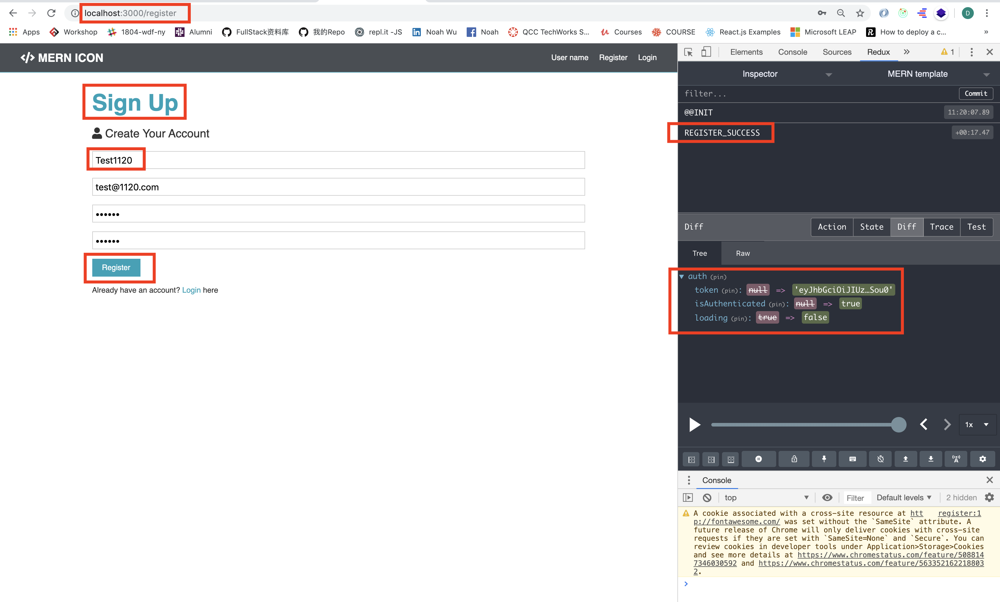
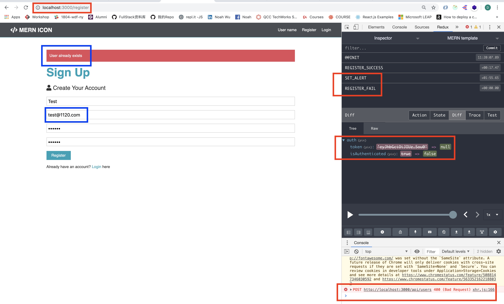
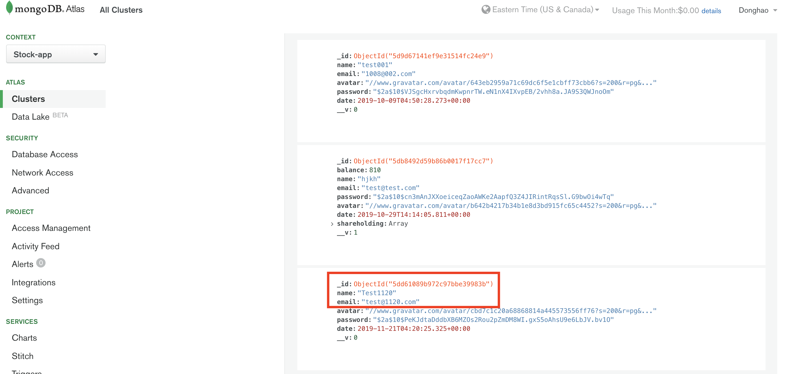

# MERN-Template(part 10)
## `Section: Frontend`(Register a new user)

### `Summary`: In this documentation, we register a new user in the front end form, and call the back end api to add a new user in database.

### `问题：`在这段代码后留下一个问题，如何保持用户保持登录状态？

- （重要用法）在这个部分，演示了如何在一个dispatch函数中引用另外一个dispatch函数：
```js
//这是一个async dispatch 函数片段，注意使用setAlert的用法。
try {
    const res = await axios.post('/api/users', body, config);
    dispatch({
        type: REGISTER_SUCCESS,
        payload: res.data,
    })
} catch (error) {
    //---./routes/users.js line 23
    const errors = error.response.data.errors;

    if (errors) {
        errors.forEach(error => dispatch(
            setAlert(error.msg, 'danger')
        ))
    }
    dispatch({
        type: REGISTER_FAIL
    })
}
```

### `RECAP:`

- `Connect a redux method to a component`
```diff
+ connect -> method -> connect component -> PropTypes -> set PropTypes
```
- `Connect a redux method to a component`
```diff
+ connect -> mapStateToProps -> connect component -> PropTypes -> set PropTypes
```
- `Design a new reducer`
```bash
1. 在`./client/src/reducers/index.js`增加新state变量名称
2. 在`./client/src/actions/types.js`增加新type变量
3. 在`./client/src/reducers`增加新reducer文件
4. 在`./client/src/actions`增加新method文件
```

### `Check Dependencies:`

- concurrently (back-end)
- react
- axios
- react-router-dom
- redux
- react-redux
- redux-thunk
- redux-devtools-extension
- moment
- react-moment
- uuid

### `Brief Contents & code position`
- *10.1 Add a new reducer(state) to combineReducers.`./client/src/reducers/index.js`
- *10.2 Add new types variable.`./client/src/actions/types.js`
- *10.3 Create the auth reducer(state). `./client/src/reducers/auth.js`
- *10.4 Create the auth method. `./client/src/actions/auth.js`
- *10.5 Connect the Register component. `./client/src/components/auth/Register.js`

### `Step1: Add a new reducer(state) to combineReducers:`

#### `(*10.1)Location: ./client/src/reducers/index.js`

```js
import { combineReducers } from 'redux';
import alert from './alert';
import auth from './auth'

//components can access state from here.
export default combineReducers({
    alert: alert,
    auth: auth
});
```

#### `Comments:`
- Add new reducer is the first step, so that every component inside store can use the state.

### `Step2: Add new types variable.`

#### `(*10.2)Location: ./client/src/actions/types.js`

```js
//for alert reducer
export const SET_ALERT = 'SET_ALERT';
export const REMOVE_ALERT = 'REMOVE_ALERT';
//for auth reducer
export const REGISTER_SUCCESS = 'REGISTER_SUCCESS';
export const REGISTER_FAIL = 'REGISTER_FAIL';
```

#### `Comments:`
- Think about how many results can get from register, then add the types variable.


### `Step3: Create the auth reducer(state).`

#### `(*10.3)Location: ./client/src/reducers/auth.js`

```js
import { REGISTER_SUCCESS, REGISTER_FAIL} from '../actions/types';

const initialState = {
    token: localStorage.getItem('token'),
    isAuthenticated: null,
    loading: true,
    user: null,
}
export default function (state = initialState, action) {
    const { type, payload } = action;
    switch (type) {
        case REGISTER_SUCCESS:
            localStorage.setItem('token', payload.token)
            return {
                ...state,
                ...payload,
                isAuthenticated: true,
                loading: false,
            }
        case REGISTER_FAIL:
            localStorage.removeItem('token');
            return {
                ...state,
                token: null,
                isAuthenticated: false,
                loading: false,
            }
        default:
            return state;
    }
}
```

#### `Comments:`
- 在这里有几个重要的设计，第一个是`token: localStorage.getItem('token')`，就是说起到初始状态时检测是否在本地cookies中保留token
- 第二个是`localStorage.setItem('token', payload.token)`当注册成功时，后端返回一个token，首先要做的事情是把这个有效token放在cookies中，作为全局变量。
- 第三个是`...payload,`这个操作相当于向state加入一个新property ---> token。（是否也可以这样写：token: payload.token？）答案是可以的！
- 第四个是`loading：false`这个相当于检测整个行为是否完成，对于一些长时间的API call进行行为终止检测很重要。
- 第五个时`isAuthenticated: true`这不是一个全局变量，因为是一个stateless变量，每次刷新页面的时候都会返回原始状态（null），但后面会有代码让它持续刷新，保证处于授权状态才能发出request，这个变量是不能成为全局变量的（这应该处理涉及多设备登陆的情况）。
- 第六个是无论是否成功register，都只改变auth state中的3个变量，而没有动user变量，这是比较好奇的，（改变user的工作交给了后面的LoadUser函数）。

### `Step4: Create the auth method.`

#### `(*10.4)Location: ./client/src/actions/auth.js`

```js
import axios from 'axios';
import { REGISTER_SUCCESS, REGISTER_FAIL} from './types';
import { setAlert } from './alert';

export const register = ({ name, email, password }) => async dispatch => {
    const config = {
        headers: {
            'Content-Type': 'application/json',
        }
    }
    const body = JSON.stringify({
        name: name,
        email: email,
        password: password,
    })

    try {
        const res = await axios.post('/api/users', body, config);
        dispatch({
            type: REGISTER_SUCCESS,
            payload: res.data,
        })
    } catch (error) {
        //---./routes/users.js line 23
        const errors = error.response.data.errors;

        if (errors) {
            errors.forEach(error => dispatch(
                setAlert(error.msg, 'danger')
            ))
        }
        dispatch({
            type: REGISTER_FAIL
        })
    }
}
```

#### `Comments:`
- 在这里有几个重要的设计，第一个是`async dispatch`，这个说明dispatch中也可以使用try，catch，await等关键词
- 第二个是`({ name, email, password })`这里是不太明白为什么要用distructuring？不用可不可以？答案是不可以的，因为实际调用method的语句是`props.register(({ name: name, email: email, password: password }))`这里的参数是一个object，这样在取回信息是也应该是一个object。（其实也不一定要以object作为参数，如果是按顺序填入的话，不实用object而使用多个单独变量也是可以的，后面有演示。）
- 第三个是`payload: res.data`，这里要注意的是axios返回的变量虽然包含token，但是是保存在`res.data`之中，当执行dispatch后，在reducer中可以通过`action.payload.token`获得。
- 第四个是`const errors = error.response.data.errors;`这个查询为什么能这样获取错误message时，需要查看相应的后端代码，同时这个相当于back end validation在前端的展示，如何好好运用后端检验也是一个很好的话题。
- 第五个时`dispatch({type: REGISTER_FAIL})`这里会涉及几个auth state中的变量，其中一个loading: false, 这里的意思时无论是否成功，都有一个状态变量表示动作完成。
- 这个例子的error handling做的很好。

### `Step5: Connect the Register component.`

#### `(*10.5)Location: ./client/src/components/auth/Register.js`

```js
import React, { Fragment, useState } from 'react';
import { Link } from 'react-router-dom';
import { connect } from 'react-redux';
import { setAlert } from '../../actions/alert';
import { register } from '../../actions/auth';
import PropTypes from 'prop-types';

const Register = props => {
    const [formData, setFormData] = useState({
        name: '',
        email: '',
        password: '',
        password2: '',
    });

    const { name, email, password, password2 } = formData;
    const handleChange = (e) => {
        setFormData({
            ...formData, [e.target.name]: e.target.value
        })
    }

    const handleSubmit = async (e) => {
        e.preventDefault();
        if (password !== password2) {
            props.setAlert('Passwords do not match', 'danger');
        }
        else {
            props.register(({ name: name, email: email, password: password }));
        }
    }

    return (
        <Fragment>
            <h1 className="large text-primary">Sign Up</h1>
            <p className="lead"><i className="fas fa-user"></i> Create Your Account</p>
            <form className="form" action="create-profile.html" onSubmit={e => handleSubmit(e)}>
                <div className="form-group">
                    <input
                        type="text"
                        placeholder="Name"
                        name="name"
                        value={name}
                        onChange={e => handleChange(e)}
                        required
                    />
                </div>
                <div className="form-group">
                    <input
                        type="email"
                        placeholder="Email Address"
                        value={email}
                        name="email"
                        onChange={e => handleChange(e)}
                        required
                    />
                </div>
                <div className="form-group">
                    <input
                        type="password"
                        placeholder="Password"
                        name="password"
                        minLength="6"
                        value={password}
                        onChange={e => handleChange(e)}
                        required
                    />
                </div>
                <div className="form-group">
                    <input
                        type="password"
                        placeholder="Confirm Password"
                        name="password2"
                        minLength="6"
                        value={password2}
                        onChange={e => handleChange(e)}
                        required
                    />
                </div>
                <input type="submit" className="btn btn-primary" value="Register" />
            </form>
            <p className="my-1">
                Already have an account? <Link to="/login">Login </Link>here
            </p>
        </Fragment>
    )
}

Register.propTypes = {
    setAlert: PropTypes.func.isRequired,
    register: PropTypes.func.isRequired,
}

export default connect(null, { setAlert, register })(Register);
```

#### `Comments:`
- 复习connect component to redux。

### `Step6: Test it.`

- Register a new user, execute an action and change the state
<p align="center">

</p>

- Register with same email. （dispatch two actions）
<p align="center">

</p>

- Check the new user whether in database
<p align="center">

</p>