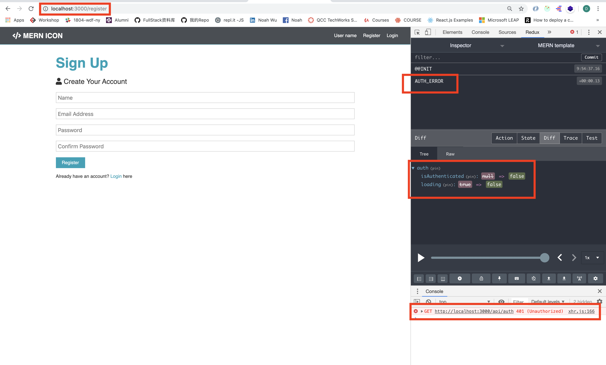
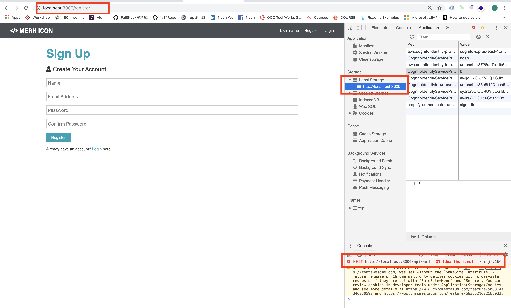
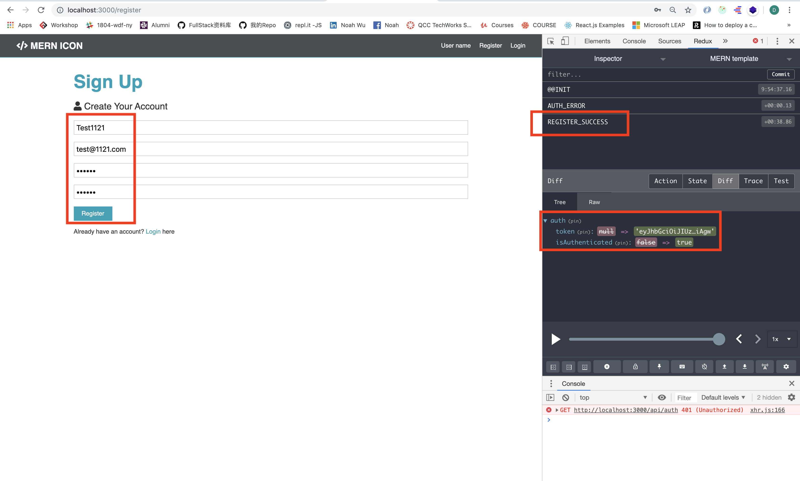
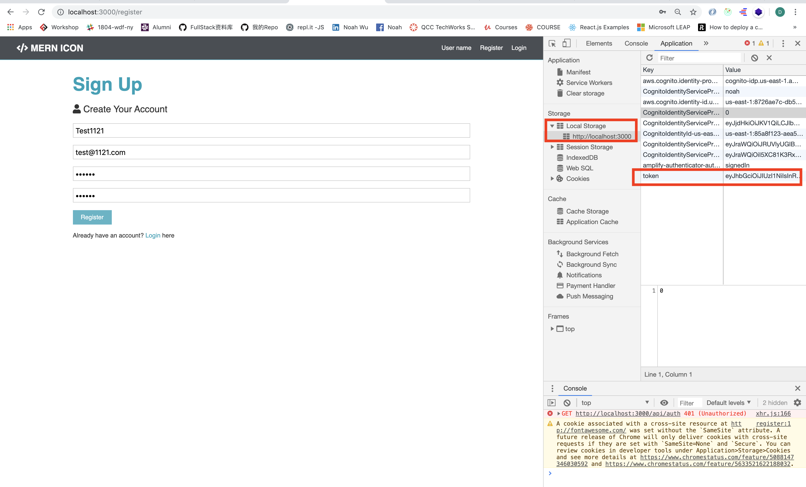
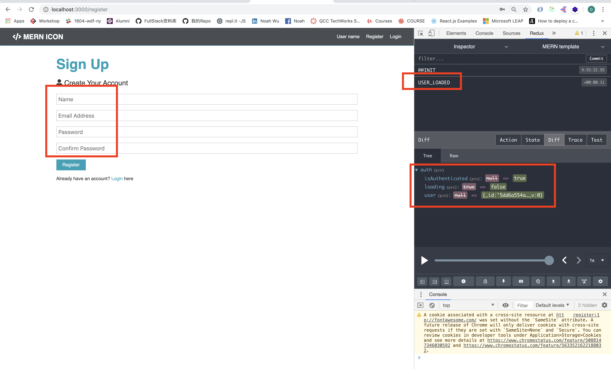
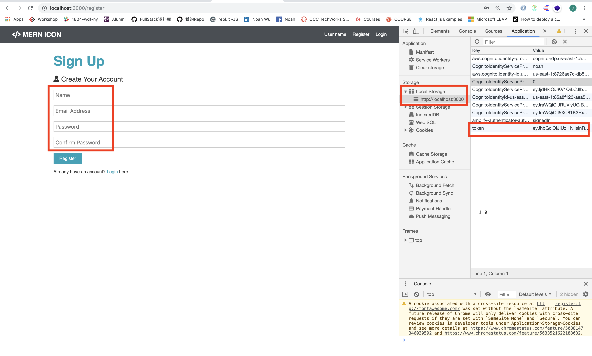

# MERN-Template(part 11)
## `Section: Frontend`(Load a user info)

### `Summary`: In this documentation, we load user info by the token in cookies, or after we register load the user info.

### `备注`：在加入useEffect后，退出程序时有时会有一点小错误。

- 要在其他地方使用定义的dispatch函数，需要在前面加上关键词`dispatch`,比如
```js
store.dispatch(loadUser())
```

<p align="center">

</p>

### `RECAP:`

- `Connect a redux method to a component`
```diff
+ connect -> method -> connect component -> PropTypes -> set PropTypes
```
- `Connect a redux method to a component`
```diff
+ connect -> mapStateToProps -> connect component -> PropTypes -> set PropTypes
```
- `Design a new reducer`
```bash
1. 在`./client/src/reducers/index.js`增加新state变量名称
2. 在`./client/src/actions/types.js`增加新type变量
3. 在`./client/src/reducers`增加新reducer文件
4. 在`./client/src/actions`增加新method文件
```

### `Check Dependencies:`

- concurrently (back-end)
- react
- axios
- react-router-dom
- redux
- react-redux
- redux-thunk
- redux-devtools-extension
- moment
- react-moment
- uuid

### `Brief Contents & code position`
- *11.1 Add new types variable.`./client/src/actions/types.js`
- *11.2 Create a new folder and new file, 'setAuthToken.js'`./client/src/utils/setAuthToken.js`
- *11.3 Create the auth reducer(state). `./client/src/reducers/auth.js`
- *11.4 Create the auth method. `./client/src/actions/auth.js`
- *11.5 Add some code in App.js.`./client/src/App.js`

### `Step1: Add new types variable.`

#### `(*11.1)Location: ./client/src/actions/types.js`

```js
//for alert reducer
export const SET_ALERT = 'SET_ALERT';
export const REMOVE_ALERT = 'REMOVE_ALERT';
//for auth reducer
export const REGISTER_SUCCESS = 'REGISTER_SUCCESS';
export const REGISTER_FAIL = 'REGISTER_FAIL';
//for user state
export const USER_LOADED = 'USER_LOADED';
export const AUTH_ERROR = 'AUTH_ERROR';
```

#### `Comments:`
- Think about how many results can get from load_user, then add the types variable.在这里设定是两种情况，分别处理读取用户信息成功和失败两种情况。

### `Step2: Create a new folder and new file, 'setAuthToken.js'.`

#### `(*11.2)Location: ../client/src/utils/setAuthToken.js`

```js
import axios from 'axios';

const setAuthToken = token => {
    if (token) {
        axios.defaults.headers.common['x-auth-token'] = token;
    }
    else {
        delete axios.defaults.headers.common['x-auth-token'];
    }
}

export default setAuthToken;
```

#### `Comments:`
- setAuthToken这个函数的功能是当有参数的时候把参数放在‘x-auth-token’，也就是自动设好token作为身份标示，如果参数为空，则清空原来的设定
- 这个函数会在两个地方使用，第一个是App.js，放在component 前先检测是否已有token在localStorage中，如果有，就设定好身份标示，这个函数会在整个application应用开始时运行一次，这样是为了防止一种情况：`已经登陆/注册的用户关闭了app，但后来又重新打开了app`，此时token还是在cookies中的。
- 第二个地方是loadUser dispatch method中，用来检测是否已经有token。

### `Step3: Create the auth reducer(state).`

#### `(*11.3)Location: ./client/src/actions/auth.js`

```js
import { REGISTER_SUCCESS, REGISTER_FAIL, USER_LOADED, AUTH_ERROR } from '../actions/types';

const initialState = {
    token: localStorage.getItem('token'),
    isAuthenticated: null,
    loading: true,
    user: null,
}

export default function (state = initialState, action) {
    const { type, payload } = action;
    switch (type) {
        case REGISTER_SUCCESS:
            localStorage.setItem('token', payload.token)
            return {
                ...state,
                ...payload,
                isAuthenticated: true,
                loading: false,
            }
        case USER_LOADED:
            return {
                ...state,
                isAuthenticated: true,
                loading: false,
                user: payload,
            }
        case REGISTER_FAIL:
        case AUTH_ERROR:
            localStorage.removeItem('token');
            return {
                ...state,
                token: null,
                isAuthenticated: false,
                loading: false,
            }
        default:
            return state;
    }
}
```

#### `Comments:`
- 这里新加入两个type，第一个是用token读取成功的话，把用户信息放在state中（这里要考虑state是不稳定的情况，需要在刷新或者重新打开app的时候重新把用户信息放在state中，这里需要一个dispatch和一个UseEffect的帮助），但这样不是会对database进行多次api call吗？（猜想此举时为了提高安全性。）
- 第二个type是当没有token或者其他原因造成向database读取用户信息失败的时候，清空state里面和cookies里面的信息，（不包括清空用户信息？？）

### `Step4: Create the auth method.`

#### `(*11.4)Location: ./client/src/actions/auth.js`

```js
import axios from 'axios';
import { REGISTER_SUCCESS, REGISTER_FAIL, USER_LOADED, AUTH_ERROR} from './types';
import { setAlert } from './alert';
import setAuthToken from '../utils/setAuthToken';

//Register user
export const register = ({ name, email, password }) => async dispatch => {
    const config = {
        headers: {
            'Content-Type': 'application/json',
        }
    }
    const body = JSON.stringify({
        name: name,
        email: email,
        password: password,
    })

    try {
        const res = await axios.post('/api/users', body, config);
        dispatch({
            type: REGISTER_SUCCESS,
            payload: res.data,
        })
    } catch (error) {
        //---./routes/users.js line 23
        const errors = error.response.data.errors;

        if (errors) {
            errors.forEach(error => dispatch(
                setAlert(error.msg, 'danger')
            ))
        }
        dispatch({
            type: REGISTER_FAIL
        })
    }
}

//Load user
export const loadUser = () => async dispatch => {
    if (localStorage.token) {
        setAuthToken(localStorage.token);
    }
    try {
        const res = await axios.get('/api/auth');
        dispatch({
            type: USER_LOADED,
            payload: res.data,
        })
    } catch (error) {
        dispatch({
            type: AUTH_ERROR
        })
    }
}
```

#### `Comments:`
- 在这里主要讨论loadUser()的用途，它是一个`async dispatch函数`它会先检测有没有token在cookies，有就自动放在‘x-auth-token'中。
- 然后不管有没有token，都会进行一个axios call尝试读取用户，如果成功读取就在reducer中把用户信息附上，如果不成功就清除reducer中的信息。

### `Step5: Add some code in App.js.`

#### `(*11.5)Location: ./client/src/App.js`

```js
import React, { Fragment, useEffect } from 'react';
import { BrowserRouter as Router, Route, Switch } from 'react-router-dom'
//components
import Navbar from './components/layout/Navbar';
import Landing from './components/layout/Landing';
import Login from './components/auth/Login';
import Register from './components/auth/Register';
import Alert from './components/layout/Alert';
//Redux & files
import { Provider } from 'react-redux';
import store from './store';
import { loadUser } from './actions/auth';
import setAuthToken from './utils/setAuthToken';
//css
import './App.css';

//check the localStorage.token every time when refresh or open
if (localStorage.token) {
  setAuthToken(localStorage.token);
}

const App = () => {
  //componentDidMount
  useEffect(() => {
    store.dispatch(loadUser());
  }, []);

  return (
    <Provider store={store}>
      <Router>
        <Fragment>
          <Navbar />
          <Route exact path='/' component={Landing} />
          <section className='container'>
            <Alert />
            <Switch>
              <Route exact path='/login' component={Login} />
              <Route exact path='/register' component={Register} />
            </Switch>
          </section>
        </Fragment>
      </Router>
    </Provider>
  )
}

export default App;
```

#### `Comments:`

- 在这里主要讨论两段代码，第一段：
```js
if (localStorage.token) {
  setAuthToken(localStorage.token);
}
```
- 这个意思是每一次开启或重启app或者刷新时，都且只会检测一次cookies有没有token，有就作为每次发送api call的身份识别。
- 第二段：
```js
  useEffect(() => {
    store.dispatch(loadUser());
  }, []);
```
- 这个意思是每一次有state改变时，即引发re-render的时候，都会触动这个里面的函数loadUser()，而且是dispatch方式进行。而如果不放第二参数[]，当loadUser()改变state时，又会引发re-render，如此陷入循环。加入第二参数[]，可以使运行仅一次，在这里暂时理解为componentDidMount(),在收到state改变时，都会强制进行且只进行一次读取用户信息动作（解释的不太好）。

- 由以上可知，setAuthToken在app启动时会运行两次，一次在加载html前，一次在render前，app启动后每发出一次request都会运行一次（在useEffect内）。

#### “重点”：通过第二段函数，`可以实现app在改变state/发送请求/refresh/render/之前都会强制先读一次用户信息，确认用户是否已成功读取并且授权`，从而保持相关reducer（state）里面的信息，从而保证先确定是否处于登录授权状态。从这里也大概能解释为什么不把isAuthencatied设置为全局变量的原因，app要保持时刻保证用户状态才能决定能否发出请求。（疑问是每次都要向database发送api call会不会负荷太大？）

### `Step6: Test it.`

- Before you register a new user, the loadUser() runs once, cannot get a user info.
<p align="center">

</p>

- No token in localStorage
<p align="center">

</p>

- After register a new user, get 'REGISTER_SUCCESS', and change the state, but the state is not persistent, which means it will initiate after a refresh if we don't add userEffect method.`(But the token is already in localStorage)`
<p align="center">

</p>

- Token is in localStorage
<p align="center">

</p>

- After we refresh, useEffect works and run loadUser() dispatch method, which calls the backend and set state before every request or refresh.
<p align="center">

</p>

- Token is still in localStorage.
<p align="center">

</p>