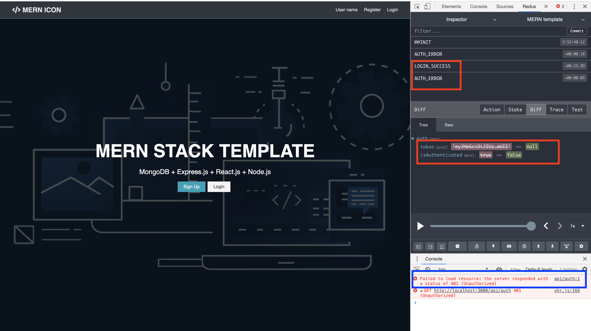
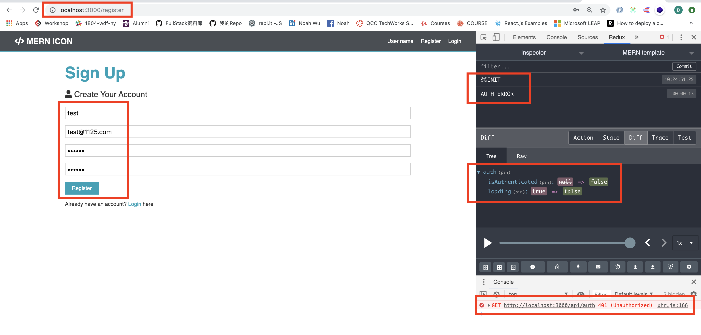
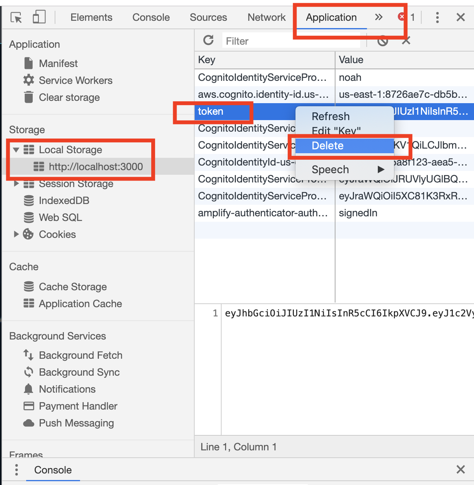
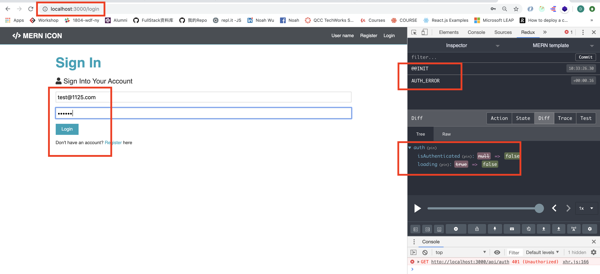
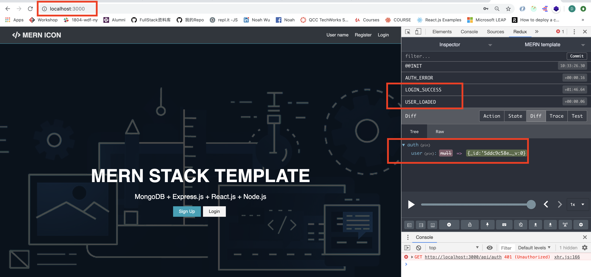

# MERN-Template(part 12)
## `Section: Frontend`(Login a user)

### `Summary`: In this documentation, we login a new user in the front end form, and redirect to home page.

### `Bug notes:`

- 端口占用
<p align="center">

</p>

- 解决方法：查找并关闭端口
```bash
$ ps aux | grep node
$ kill -9 PID
```

- 登陆即退出
<p align="center">

</p>

- 解决方法：后端加密secrect前后不一，文件位置：`./aip/auth.js`
```diff
+ const config = require('config');
+ config.get('jwtSecret'),(jwt.sign函数内）

- 'mysecrettoken',(jwt.sign函数内）
```

### `RECAP:`

- `Connect a redux method to a component`
```diff
+ connect -> method -> connect component -> PropTypes -> set PropTypes
```
- `Connect a redux method to a component`
```diff
+ connect -> mapStateToProps -> connect component -> PropTypes -> set PropTypes
```
- `Design a new reducer`
```bash
1. 在`./client/src/reducers/index.js`增加新state变量名称
2. 在`./client/src/actions/types.js`增加新type变量
3. 在`./client/src/reducers`增加新reducer文件
4. 在`./client/src/actions`增加新method文件
```

### `Check Dependencies:`

- concurrently (back-end)
- react
- axios
- react-router-dom
- redux
- react-redux
- redux-thunk
- redux-devtools-extension
- moment
- react-moment
- uuid

### `Brief Contents & code position`
- *12.1 Add new types variable.`./client/src/actions/types.js`
- *12.2 Set up reducer(state). `./client/src/reducers/auth.js`
- *12.3 Create the login method. `./client/src/actions/auth.js`
- *12.4 Connect the Login component. `./client/src/components/auth/Login.js`
- *12.5 Add Redirect to Register component. `./client/src/components/auth/Register.js`

### `Step1: Add new types variable.`

#### `(*12.1)Location: ./client/src/actions/types.js`

```js
//for alert reducer
export const SET_ALERT = 'SET_ALERT';
export const REMOVE_ALERT = 'REMOVE_ALERT';
//for auth reducer
export const REGISTER_SUCCESS = 'REGISTER_SUCCESS';
export const REGISTER_FAIL = 'REGISTER_FAIL';
//for user state
export const USER_LOADED = 'USER_LOADED';
export const AUTH_ERROR = 'AUTH_ERROR';
//for login
export const LOGIN_SUCCESS = 'LOGIN_SUCCESS';
export const LOGIN_FAIL = 'LOGIN_FAIL';
```

#### `Comments:`
- Think about how many results can get from login, then add the types variable. LOGIN_FAIL is for error handling.

### `Step2: Set up reducer(state).`

#### `(*12.2)Location: ./client/src/reducers/auth.js`

```js
import { REGISTER_SUCCESS, REGISTER_FAIL, USER_LOADED, AUTH_ERROR, LOGIN_FAIL, LOGIN_SUCCESS } from '../actions/types';

const initialState = {
    token: localStorage.getItem('token'),
    isAuthenticated: null,
    loading: true,
    user: null,
}

export default function (state = initialState, action) {
    const { type, payload } = action;
    switch (type) {
        case REGISTER_SUCCESS:
        case LOGIN_SUCCESS:
            localStorage.setItem('token', payload.token)
            return {
                ...state,
                ...payload,
                isAuthenticated: true,
                loading: false,
            }
        case USER_LOADED:
            return {
                ...state,
                isAuthenticated: true,
                loading: false,
                user: payload,
            }
        case REGISTER_FAIL:
        case AUTH_ERROR:
        case LOGIN_FAIL:
            localStorage.removeItem('token');
            return {
                ...state,
                token: null,
                isAuthenticated: false,
                loading: false,
            }
        default:
            return state;
    }
}
```

#### `Comments:`
- LOGIN_SUCCESS 跟 REGESTER_SUCCESS是一致的，LOGIN_FAIL 跟REGISTER_FAIL是一致的。

### `Step3: Create the login method.`

#### `(*12.3)Location: ./client/src/actions/auth.js`

```js
import axios from 'axios';
import { REGISTER_SUCCESS, REGISTER_FAIL, USER_LOADED, AUTH_ERROR, LOGIN_SUCCESS, LOGIN_FAIL } from './types';
import { setAlert } from './alert';
import setAuthToken from '../utils/setAuthToken';

//Load user
export const loadUser = () => async dispatch => {
    if (localStorage.token) {
        setAuthToken(localStorage.token);
    }
    try {
        const res = await axios.get('/api/auth');
        dispatch({
            type: USER_LOADED,
            payload: res.data,
        })
    } catch (error) {
        dispatch({
            type: AUTH_ERROR
        })
    }
}

//Register user
export const register = ({ name, email, password }) => async dispatch => {
    const config = {
        headers: {
            'Content-Type': 'application/json',
        }
    }
    const body = JSON.stringify({
        name: name,
        email: email,
        password: password,
    })

    try {
        const res = await axios.post('/api/users', body, config);
        dispatch({
            type: REGISTER_SUCCESS,
            payload: res.data,
        })

        dispatch(loadUser());

    } catch (error) {
        //---./routes/users.js line 23
        const errors = error.response.data.errors;

        if (errors) {
            errors.forEach(error => dispatch(
                setAlert(error.msg, 'danger')
            ))
        }
        dispatch({
            type: REGISTER_FAIL,
        })
    }
}

//Login user
export const login = (email, password) => async dispatch => {
    const config = {
        headers: {
            'Content-Type': 'application/json',
        }
    }
    const body = JSON.stringify({
        email: email,
        password: password,
    })

    try {
        const res = await axios.post('/api/auth', body, config);
        dispatch({
            type: LOGIN_SUCCESS,
            payload: res.data,
        })

        dispatch(loadUser());

    } catch (error) {
        //---./routes/users.js line 23
        const errors = error.response.data.errors;

        if (errors) {
            errors.forEach(error => dispatch(
                setAlert(error.msg, 'danger')
            ))
        }
        dispatch({
            type: LOGIN_FAIL,
        })
    }
}
```

#### `Comments:`
- 在这里，login函数跟register函数差不多，但在register和login函数中都加了一句：
```js
dispatch(loadUser());
```
- 以上代码就是显示了如何在一个函数中`引用dispatch函数`，其作用就是当注册新用户或者登陆一个用户的时候，随后的动作就是把相关用户信息从database拿下来并附在reducer(state)当中。

### `Step4: Connect the Login component.`

#### `(*12.4)Location: ./client/src/components/auth/Login.js`

```js
import React, { Fragment, useState } from 'react';
import { Link, Redirect } from 'react-router-dom';
import { connect } from 'react-redux';
import PropTypes from 'prop-types';
import { login } from '../../actions/auth'

const Login = props => {
    const [formData, setFormData] = useState({
        email: '',
        password: '',
    });

    const { email, password } = formData;
    const handleChange = (e) => {
        setFormData({
            ...formData, [e.target.name]: e.target.value
        })
    }

    const handleSubmit = async (e) => {
        e.preventDefault();
        props.login(email, password);
    }

    if (props.isAuthenticated) {
        return <Redirect to='/' />
    }

    return (
        <Fragment>
            <h1 className="large text-primary">Sign In</h1>
            <p className="lead"><i className="fas fa-user"></i> Sign Into Your Account</p>
            <form className="form" action="create-profile.html" onSubmit={e => handleSubmit(e)}>
                <div className="form-group">
                    <input
                        type="email"
                        placeholder="Email Address"
                        value={email}
                        name="email"
                        onChange={e => handleChange(e)}
                        required />
                </div>
                <div className="form-group">
                    <input
                        type="password"
                        placeholder="Password"
                        name="password"
                        minLength="6"
                        value={password}
                        onChange={e => handleChange(e)}
                        required
                    />
                </div>
                <input type="submit" className="btn btn-primary" value="Login" />
            </form>
            <p className="my-1">
                Don't have an account? <Link to="/register">Register </Link>here
                </p>
        </Fragment>
    )
}

Login.propTypes = {
    login: PropTypes.func.isRequired,
    isAuthenticated: PropTypes.bool,
}

const mapStateToProps = state => ({
    isAuthenticated: state.auth.isAuthenticated
})

export default connect(mapStateToProps, { login })(Login);
```

#### `Comments:`
- 复习connect component to redux。
- 在这里的连接过程中引入了几个东西，第一个是函数login，第二个是reducer（state）中的auth.isAuthenticated，第三个是Redirect，method和state连接component的形式可以参考：[Redux-Connection](https://github.com/DonghaoWu/MERN-Template-Documentation/blob/master/README-Folder/Front-end(part6-9)/9-Redux-Connection.md)

- 关于Redirect的应用
```js
import { Redirect } from 'react-router-dom';
if (props.isAuthenticated) {
    return <Redirect to='/' />
}
```
- 这一段放在return之前，意思就是先运行这个代码。Redirect代码段的使用和位置都值得注意，在react里面，不同的位置的代码的功能不一样。

### `Step5: Add Redirect to Register component.`

#### `(*12.5)Location: ./client/src/components/auth/Register.js`

- 在 Register component 中加入上面Redirect代码。


### `Step6: Test it.`

- Register a new user.
<p align="center">

</p>

- Load the user and Redirect.
<p align="center">

</p>

- Delete the token in local Storage, Login with the new user.
<p align="center">

</p>

<p align="center">

</p>

- Load the user and Redirect.
<p align="center">

</p>