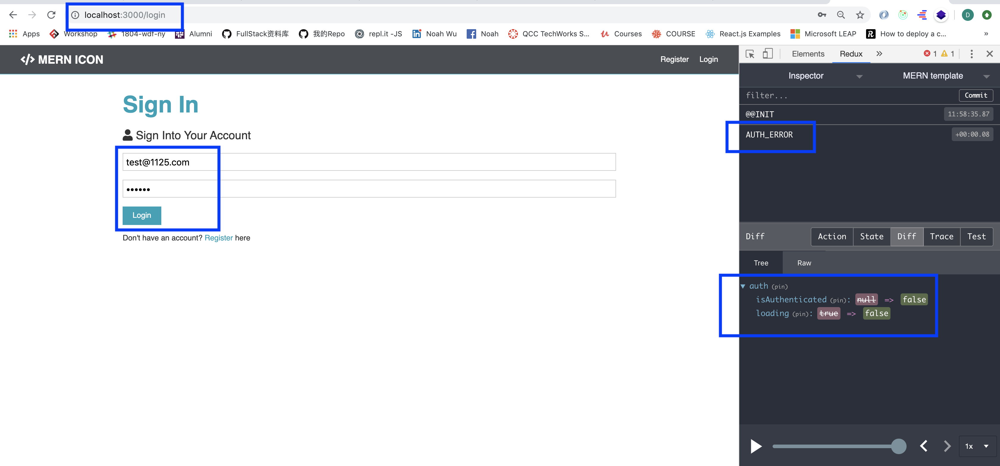
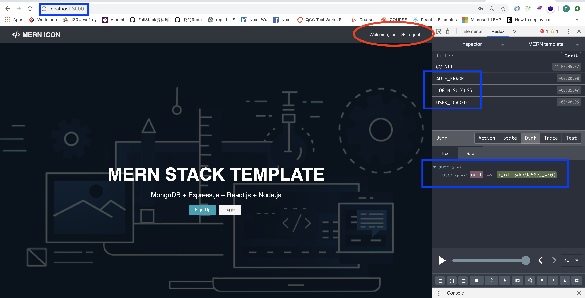
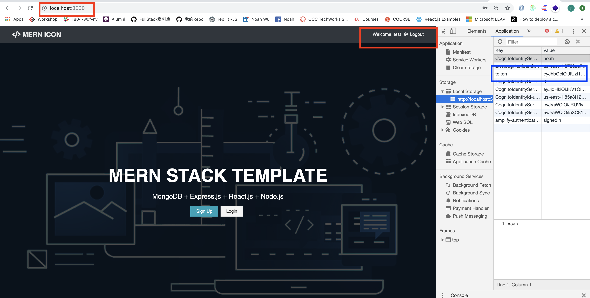
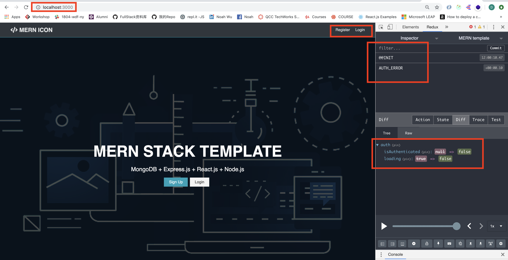
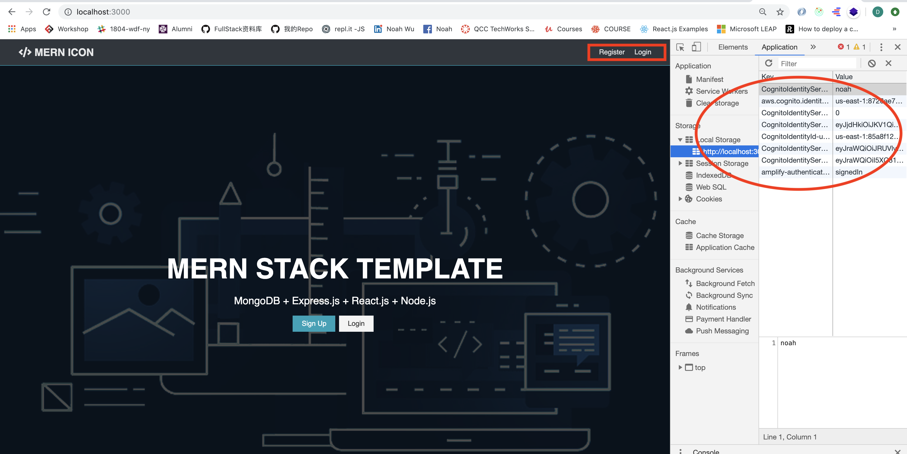

# MERN-Template(part 13)
## `Section: Frontend`(Logout a user)

### `Summary`: In this documentation, we logout a new user in the front end, and change the navbar in home page.


### `RECAP:`

- `Connect a redux method to a component`
```diff
+ connect -> method -> connect component -> PropTypes -> set PropTypes
```
- `Connect a redux method to a component`
```diff
+ connect -> mapStateToProps -> connect component -> PropTypes -> set PropTypes
```
- `Design a new reducer`
```bash
1. 在`./client/src/reducers/index.js`增加新state变量名称
2. 在`./client/src/actions/types.js`增加新type变量
3. 在`./client/src/reducers`增加新reducer文件
4. 在`./client/src/actions`增加新method文件
```

### `Check Dependencies:`

- concurrently (back-end)
- react
- axios
- react-router-dom
- redux
- react-redux
- redux-thunk
- redux-devtools-extension
- moment
- react-moment
- uuid

### `Brief Contents & code position`
- *13.1 Add new types variable.`./client/src/actions/types.js`
- *13.2 Set up reducer(state). `./client/src/reducers/auth.js`
- *13.3 Create the logout method. `./client/src/actions/auth.js`
- *13.4 Connect the Navbar component. `./client/src/components/layout/Navbar.js`

### `Step1: Add new types variable.`

#### `(*13.1)Location: ./client/src/actions/types.js`

```js
//for alert reducer
export const SET_ALERT = 'SET_ALERT';
export const REMOVE_ALERT = 'REMOVE_ALERT';
//for auth reducer
export const REGISTER_SUCCESS = 'REGISTER_SUCCESS';
export const REGISTER_FAIL = 'REGISTER_FAIL';
//for user state
export const USER_LOADED = 'USER_LOADED';
export const AUTH_ERROR = 'AUTH_ERROR';
//for login
export const LOGIN_SUCCESS = 'LOGIN_SUCCESS';
export const LOGIN_FAIL = 'LOGIN_FAIL';
//for log out
export const LOGOUT = 'LOGOUT';
```

#### `Comments:`
- Think about how many results can get from logout, then add the types variable. 

### `Step2: Set up reducer(state).`

#### `(*13.2)Location: ./client/src/reducers/auth.js`

```js
import { REGISTER_SUCCESS, REGISTER_FAIL, USER_LOADED, AUTH_ERROR, LOGIN_FAIL, LOGIN_SUCCESS, LOGOUT } from '../actions/types';

const initialState = {
    token: localStorage.getItem('token'),
    isAuthenticated: null,
    loading: true,
    user: null,
}

export default function (state = initialState, action) {
    const { type, payload } = action;
    switch (type) {
        case REGISTER_SUCCESS:
        case LOGIN_SUCCESS:
            localStorage.setItem('token', payload.token)
            return {
                ...state,
                ...payload,
                isAuthenticated: true,
                loading: false,
            }
        case USER_LOADED:
            return {
                ...state,
                isAuthenticated: true,
                loading: false,
                user: payload,
            }
        case REGISTER_FAIL:
        case AUTH_ERROR:
        case LOGIN_FAIL:
        case LOGOUT:
            localStorage.removeItem('token');
            return {
                ...state,
                token: null,
                isAuthenticated: false,
                loading: false,
            }
        default:
            return state;
    }
}
```

#### `Comments:`
- LOGOUT 跟 REGISTER_FAIL 是一致的，清除state的信息和localStorage的token信息。

### `Step3: Create the logout method.`

#### `(*13.3)Location: ./client/src/actions/auth.js`

```js
import axios from 'axios';
import { REGISTER_SUCCESS, REGISTER_FAIL, USER_LOADED, AUTH_ERROR, LOGIN_SUCCESS, LOGIN_FAIL, LOGOUT } from './types';
import { setAlert } from './alert';
import setAuthToken from '../utils/setAuthToken';

//Load user
export const loadUser = () => async dispatch => {
    if (localStorage.token) {
        setAuthToken(localStorage.token);
    }
    try {
        const res = await axios.get('/api/auth');
        dispatch({
            type: USER_LOADED,
            payload: res.data,
        })
    } catch (error) {
        dispatch({
            type: AUTH_ERROR
        })
    }
}

//Register user
export const register = ({ name, email, password }) => async dispatch => {
    const config = {
        headers: {
            'Content-Type': 'application/json',
        }
    }
    const body = JSON.stringify({
        name: name,
        email: email,
        password: password,
    })

    try {
        const res = await axios.post('/api/users', body, config);
        dispatch({
            type: REGISTER_SUCCESS,
            payload: res.data,
        })

        dispatch(loadUser());

    } catch (error) {
        //---./routes/users.js line 23
        const errors = error.response.data.errors;

        if (errors) {
            errors.forEach(error => dispatch(
                setAlert(error.msg, 'danger')
            ))
        }
        dispatch({
            type: REGISTER_FAIL,
        })
    }
}

//Login user
export const login = (email, password) => async dispatch => {
    const config = {
        headers: {
            'Content-Type': 'application/json',
        }
    }
    const body = JSON.stringify({
        email: email,
        password: password,
    })

    try {
        const res = await axios.post('/api/auth', body, config);
        dispatch({
            type: LOGIN_SUCCESS,
            payload: res.data,
        })

        dispatch(loadUser());

    } catch (error) {
        //---./routes/users.js line 23
        const errors = error.response.data.errors;

        if (errors) {
            errors.forEach(error => dispatch(
                setAlert(error.msg, 'danger')
            ))
        }
        dispatch({
            type: LOGIN_FAIL,
        })
    }
}

//Logout
export const logout = () => dispatch => {
    dispatch({
        type: LOGOUT,
    })
}
```

#### `Comments:`
- 暂无。

### `Step4: Connect the Navbar component.`

#### `(*13.4)Location: ./client/src/components/layout/Navbar.js`

```js
import React, { Fragment } from 'react';
import { Link } from 'react-router-dom';
import { connect } from 'react-redux';
import PropTypes from 'prop-types';
import { logout } from '../../actions/auth'

const Navbar = props => {
    const { logout, auth } = props;
    const authLinks = (
        <ul>
            {auth.user ? <li>Welcome, {auth.user.name}</li> : null}
            <li>
                <a onClick={logout} href='/'>
                    <i className = 'fas fa-sign-out-alt'></i>{' '}
                    <span className = 'hide-sm'>Logout</span>
                </a>
            </li>
        </ul>
    );

    const guestLinks = (
        <ul>
            <li><Link to="/register">Register</Link></li>
            <li><Link to="/login">Login</Link></li>
        </ul>
    );

    return (
        <nav className="navbar bg-dark">
            <h1>
                <Link to="/"><i className="fas fa-code"></i> MERN ICON</Link>
            </h1>
            {
                !auth.loading && (<Fragment>
                    {
                        auth.isAuthenticated ? authLinks : guestLinks
                    }
                </Fragment>)
            }
        </nav>
    )
}

Navbar.propTypes = {
    logout: PropTypes.func.isRequired,
    auth: PropTypes.object.isRequired,
}

const mapStateToProps = state => ({
    auth: state.auth
})

export default connect(mapStateToProps, { logout })(Navbar);
```

#### `Comments:`
- 复习connect component to redux。
- 这段代码里面常用的方法是用ternary配合state进行前端的切换显示，也是前端设计的很重要的方法之一。

### `Step5: Test it.`

- Login with a user.
<p align="center">

</p>

- Redirect and change the navbar.
<p align="center">

</p>

- A new token in local storage.
<p align="center">

</p>

- Logout the user, change the navbar.
<p align="center">

</p>

- Delete the token in local storage.
<p align="center">

</p>