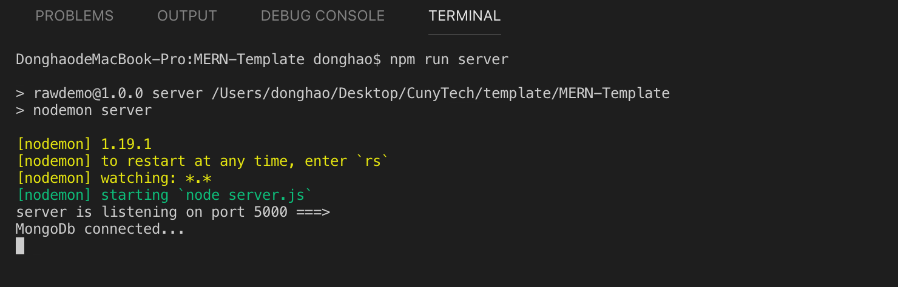

# MERN-Template-Guide

## This is a guide for using this template.

## Quick final view(deployed):

<p align="center">

</p>

### `Check Dependencies`
`Back end dependencies: ./package.json:`

- express
- morgan
- nodemon
- mongoose
- express-validator
- gravatar
- bcryptjs
- jsonwebtoken
- concurrently

`Front end dependencies: ./client/package.json:`

- react
- axios
- react-router-dom
- redux
- react-redux
- redux-thunk
- redux-devtools-extension
- moment
- react-moment
- uuid

### `Brief Contents & codes position`
1. Download the repo and install the dependencies.
2. Set up MongoDB Altas.
3. Create a folder called 'config' in top directory.
4. Add a new database model (back end).
5. Add a new back end api route (back end).
6. Add a new component (front end).
7. Add a new state.(front end).
7. Add a new reducer.(front end).
8. Add a new action.(front end).
9. Connect component with action or state.(front end)

### `Step1: Download the repo and install the dependencies`

- Copy the repo link.
<p align="center">

</p>

### `Step2: MongoDB Altas set up`

<ol>
<li> Sign in</li>
<li> Build a new Cluster</li>
<li> Set up DataBase access</li>

<p align="center">

</p>

<li> Set up Network access</li>

<p align="center">

</p>

<li> Click on Clusters</li>
<li> Click on connect</li>

<p align="center">

</p>

<li> Click on Connect to your application</li>

<p align="center">

</p>

<li> Copy your connection string</li>
<p align="center">

</p>

</ol>

### `Step2: Set up your Mongo String`

#### `Now, you can get a connection string like this`

```js
mongodb+srv://donghao:<password>@cluster-mren-tygf4.mongodb.net/test?retryWrites=true&w=majority
```

#### `Replace the <password> with the user password from MongoDB Altas, you can find it here`

- picture 1

  <p align="center">
  
  </p>

- picture 2 or you can edit and update your password here.

  <p align="center">
  
  </p>

- picture 3

<p align="center">

</p>

### `Step3: Time to code`

#### - `Install dependencies`
#### - `DB initialization.`
```bash
$ npm install --save mongoose
$ npm install --save config
```

- create a new folder call 'config',then a new file 'default.json'

`(*1.1)location: ./config.default.json`

```js
{
    "mongoURI":"mongodb+srv://donghao:<password>@cluster0-qvchz.mongodb.net/test?retryWrites=true&w=majority",
}
```
Notice: `Replace the <password> with the user password`

- create a new file 'db.js'

`(*1.2)location: ./config/db.js`

```js
const mongoose = require('mongoose');
const config = require('config');
const db = config.get('mongoURI');

const connectDB = async () => {
    try {
        await mongoose.connect(db, {
            useNewUrlParser: true,
            useUnifiedTopology: true,
            useCreateIndex: true,
            useFindAndModify: false,
        });
        console.log('MongoDb connected...');
    } catch (err) {
        console.error(err.message);
        process.exit(1);
    }
}

module.exports = connectDB;
```

- #### `Express server set up.`

`Install dependencies`

```bash
$ npm install --save express
$ npm install --save nodemon
```

`Add code, location: server.js`

```js
//package
const express = require('express');
//apply
const app = express();
//middleware
app.use(express.json({ extended: false }));
//port
const PORT = process.env.PORT || 5000;

/*
DB here!
*/

/*
Routes here!
*/

app.listen(PORT, () => console.log(`server is listening on port ${PORT} ===>`));
```

- #### `Finally, server.js should look like this:`

`(*1.3)location: ./server.js`

```js
//package
const express = require('express');
const connectDB = require('./config/db');
//apply
const app = express();
//middleware
app.use(express.json({ extended: false }));
//port
const PORT = process.env.PORT || 5000;

/*
DB here!
*/
connectDB();

/*
Routes here!
*/

app.listen(PORT, () => console.log(`server is listening on port ${PORT} ===>`));
```

`(*1.4)location: ./package.json`: add Scripts
```js
  "scripts": {
    "start": "node server",
    "server": "nodemon server"
  },
```

`Note:`

- Before test, you should change the mongoDB connection String and password to your own.

### `Step4: Test and run`

`Location:root directory`

```bash
$ npm run server
```

- If you get this, it means everything works well.

<p align="center">

</p>

`Side-note: What is the middleware used for?(position:*1.3)`

- app.use(express.json({ extended: false }))
- app.use(express.urlencoded({ extended: true }))
- app.use(morgan('dev'))

`Side-note: What are these set up used for?(position:*1.2)`

- useNewUrlParser: true
- useCreateIndex: true
