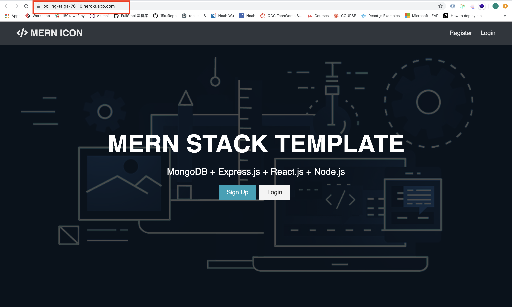
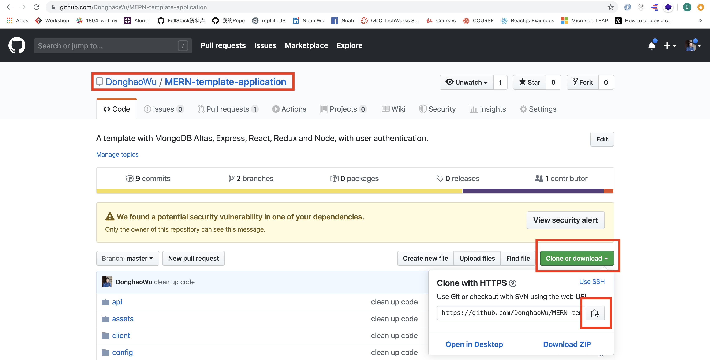
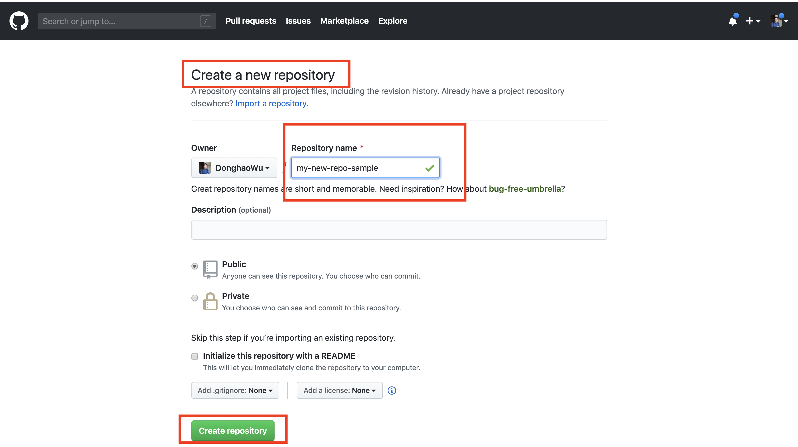
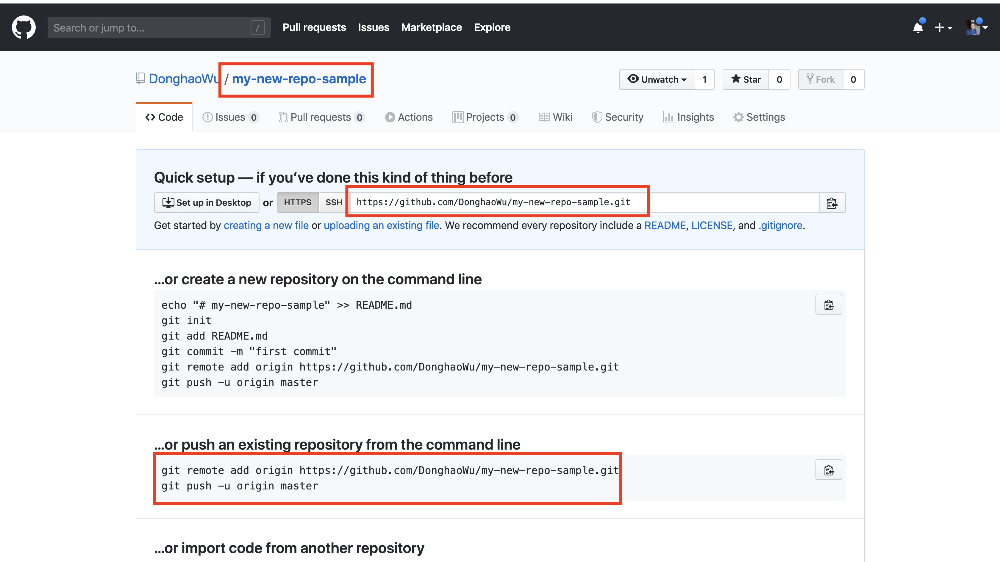
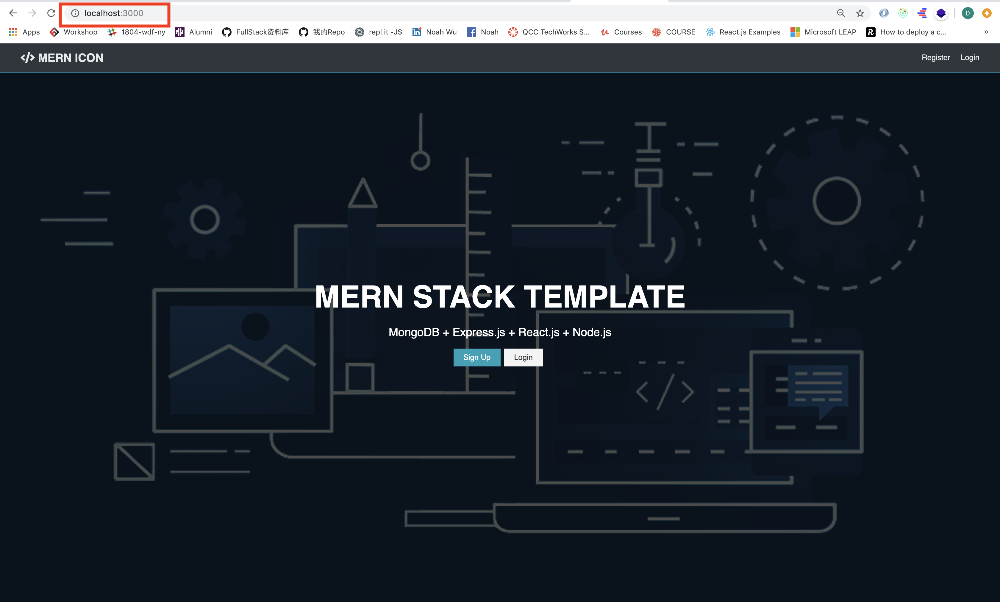
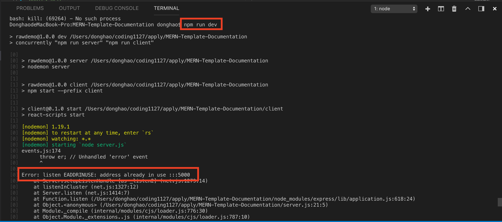
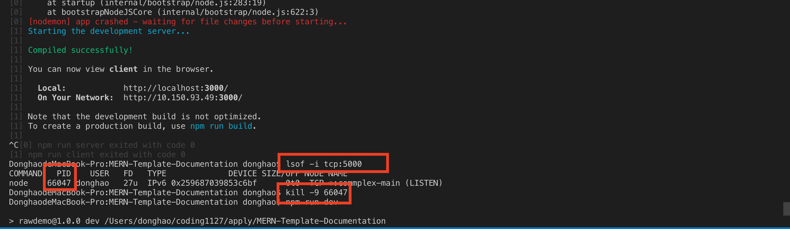

# MERN-Template-Guide

## This is a guide for using this template.

## Quick final view(deployed):

<p align="center">

</p>

### `Check Dependencies`
`Back end dependencies: ./package.json:`

- express
- morgan
- nodemon
- mongoose
- express-validator
- gravatar
- bcryptjs
- jsonwebtoken
- concurrently

`Front end dependencies: ./client/package.json:`

- react
- axios
- react-router-dom
- redux
- react-redux
- redux-thunk
- redux-devtools-extension
- moment
- react-moment
- uuid

### `Brief Contents & codes position`
1. Download the repo and install the dependencies.
2. Set up MongoDB Altas.
3. Create a file called 'default.json' in 'config' folder.
4. Run the app in local.
5. Add a new database model (back end).
6. Add a new back end api route (back end).
7. Add a new component (front end).
8. Add a new state.(front end).
9. Add a new reducer.(front end).
10. Add a new action.(front end).
11. Connect component with action or state.(front end)

### `Step1: Download the repo and install the dependencies`

- Copy the repo link.
<p align="center">

</p>

- Type command in terminal.
```bash
$ git clone [Paste repo link here]
$ rm -rf .git
$ git init
$ npm install
$ cd client
$ npm install
$ cd ..
$ git add .
$ git commit -m'first commit'
$ git remote add origin [your own new repo link]
$ git push -u origin master
```

- Your can find your new repo link here when you create a new repo.
<p align="center">

</p>
<p align="center">

</p>


### `Step2: MongoDB Altas set up`

<ol>
<li> Sign in or create a new account.</li>
<li> Build a new Cluster</li>
<li> Set up DataBase access</li>

<p align="center">

</p>

<li> Set up Network access</li>

<p align="center">

</p>

<li> Click on Clusters</li>
<li> Click on connect</li>

<p align="center">

</p>

<li> Click on Connect to your application</li>

<p align="center">

</p>

<li> Copy your connection string</li>
<p align="center">

</p>

</ol>

### `Step3: Create a file called 'default.json' in 'config' folder`

#### `Now, you can get a connection string like this`

```js
mongodb+srv://donghao:<password>@cluster-mren-tygf4.mongodb.net/test?retryWrites=true&w=majority
```

#### Replace the `<password>` with the user password from MongoDB Altas, you can find it here

- A.
  <p align="center">
  
  </p>

- B. you can edit and update your password here.

  <p align="center">
  
  </p>

- C.

<p align="center">

</p>

- Add code in `default.json`

```js
{
    "mongoURI":"mongodb+srv://[connection string with password]",
    "jwtSecret":"[Put your own token secret here]"
}
```

### `Step4: Run the app in local.`

- Type command in terminal.
```bash
$ npm run dev
```

- Then you can get this in http://localhost:3000/, and you can register, login and logout, you can find the new user in MongoDB Altas.

<p align="center">

</p>

- Sometime you will have this bug

<p align="center">

</p>

- The way to fix it:

```bash
$ lsof -i tcp:[PORT NUMBER]
$ kill -9 PID
```

<p align="center">

</p>
